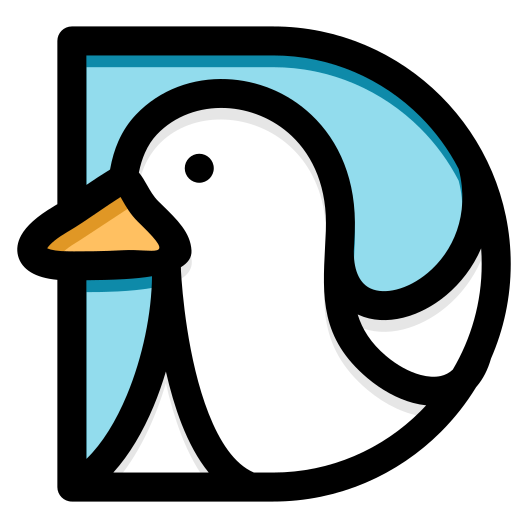
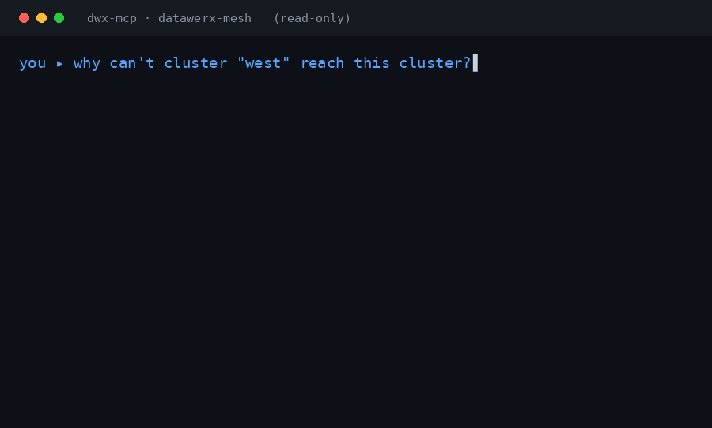

<div align="center">

# DataWerx Mesh

**Connect any Kubernetes Service, by name, from any cluster across clouds, regions, and on-prem**

No LoadBalancer. No public IP. No central broker. No CNI lock-in.

Works with Tailscale, NetBird, Cilium, WireGuard, cloud VPN

-or-

Use our batteries-included built-in overlay

[](LICENSE)
[](COMMITMENT.md)
[](https://github.com/DataWerx/datawerx-mesh/actions/workflows/ci.yml)
[](https://scorecard.dev/viewer/?uri=github.com/DataWerx/datawerx-mesh)
[](https://go.dev)





[Quickstart](#quickstart-5-minutes) · [How it works](#how-it-works) · [Why it's different](#why-its-different) · [Ask an AI](#ask-an-ai-about-your-mesh) · [Docs](docs/README.md)

</div>

## DataWerx Mesh

**It's the open-source multi-cluster service layer for Kubernetes.** 

It makes a Service in one cluster reachable — *by a stable name and IP* — from every other cluster in the mesh, **even when their pod CIDRs overlap**.

It is a single, tiny Go agent that runs as a **DaemonSet** (one pod per node). The agent watches a small set of CRDs and converges each node's network toward the desired state: it brings up cross-cluster connectivity, propagates exported Services, allocates a stable cluster-set IP per service, and serves a `*.clusterset.local` DNS zone — all with **no central broker** and **no required CNI**.

You implement the standard [Kubernetes Multi-Cluster Services API (MCS, KEP-1645)](https://github.com/kubernetes/enhancements/tree/master/keps/sig-multicluster/1645-multi-cluster-services-api) — `ServiceExport` / `ServiceImport` — and DataWerx provides the network and the machinery that MCS assumes you already have.

## The problem it solves

Kubernetes has no built-in way for a pod in cluster A to reach a Service in cluster B by name:

- **DNS is cluster-local** — `payments.prod.svc.cluster.local` means nothing in another cluster.
- **ClusterIPs aren't routable** across clusters.
- **Pod ranges collide** — two clusters both on `10.244.0.0/16` is the canonical clash.
- **The MCS API is just a contract** — it standardizes *what* a multi-cluster service looks like, but deliberately leaves out *the network and the controllers* that make it real.

DataWerx solves the **whole** path: connectivity, discovery, a stable VIP, naming, overlap, and policy.

## What you get

| | |
|---|---|
| 🌐 **Cross-cluster service discovery** | Standard K8s MCS `ServiceExport` / `ServiceImport`. Export a Service; it resolves everywhere. |
| 📛 **Service-by-name** | A `*.clusterset.local` DNS zone, served by the agent and wired into CoreDNS. |
| 🎯 **Stable cluster-set VIP + load balancing** | One virtual IP per service, **the same in every cluster**, DNAT'd and load-balanced across all exporting clusters. |
| 🔀 **Overlapping CIDRs just work** | Two clusters on the same range? DataWerx remaps them 1:1 into a virtual range instead of giving up. |
| 🔐 **Encrypted by default — or bring your own** | Built-in per-node WireGuard, *or* ride an overlay you already run (Tailscale, NetBird, Cilium, plain WireGuard, cloud VPN). |
| 🧩 **CNI-agnostic & broker-less** | Works with any CNI. No central coordinator, no database, no single point of failure. |
| 🛡️ **Cross-cluster network policy** | `MeshNetworkPolicy` extends segmentation across the mesh. |
| 📈 **Observable & operable** | Prometheus metrics, a Grafana starter dashboard, a Helm chart, and `dwx mesh verify` health checks. |
| 🤖 **AI-ready / agent-queryable** | A **read-only MCP server** plus versioned JSON state contracts (snapshot + dependency graph) let Claude — or any agent — answer *"is the mesh healthy, and why not?"* from live state. [→ Ask an AI](#ask-an-ai-about-your-mesh) |

## How it works


1. **Topology** — you declare each remote cluster as a `MeshPeer` CRD (its identity/public key, reachable endpoint, and CIDRs). Your GitOps pipeline owns these. There is no broker.
2. **Connectivity** — the per-node agent programs the data plane so remote ranges are reachable: over its **own WireGuard device**, or as **host routes over an overlay you already run** (Submariner, NetBird, etc.).
3. **Discovery (MCS)** — you mark a Service with a `ServiceExport`. The agent publishes a broker-less `EndpointExport`; every cluster that sees it builds a matching `ServiceImport`.
4. **Naming + VIP** — for each imported service the agent allocates a stable **cluster-set IP** — a pure, deterministic function of the service set, so every cluster computes the *same* IP with no coordination — and serves `name.namespace.svc.clusterset.local`. Traffic to that VIP is DNAT'd and load-balanced to the exporting clusters' real pods.

→ Full walkthrough: **[docs/how-it-works.md](docs/how-it-works.md)** · Component reference: **[ARCHITECTURE.md](ARCHITECTURE.md)**

## Why it's different

DataWerx **speaks** the standard MCS API so you avoid lock-in, but the plumbing underneath is fundamentally less invasive than the alternatives.

> **Plain MCS is a contract, not an implementation.** The MCS API defines `ServiceExport`/`ServiceImport`, the `clusterset.local` name, and the idea of a ClusterSetIP — but it explicitly leaves out the **connectivity**, the **controllers**, **how endpoints propagate**, and **how a VIP is chosen consistently**. DataWerx provides all of that. *(Deep dive: [docs/mcs-conformance.md](docs/mcs-conformance.md).)*

| | Architecture | DNS / discovery | Overlapping CIDRs | CNI lock-in | Brings the network? |
|---|---|---|---|---|---|
| **DataWerx Mesh** | **Per-node, broker-less** | **MCS, served** | **1:1 remap built in** | **No** | **Built-in WireGuard _or_ your existing overlay** |
| **Submariner** | Central broker + gateway nodes | Lighthouse (MCS) | Globalnet | No | Yes (its own way) |
| **Cilium ClusterMesh** | Per-node (eBPF) | Transparent | Limited | **Yes — requires Cilium** | Yes |
| **Tailscale** | Per-node WireGuard | Device DNS, **not Services** | N/A | No | Yes (its overlay) |
| **Plain MCS API** | *(spec only)* | Name only | Unspecified | No | **No — assumes a flat network** |


**Summary** DataWerx gives you 
- Cilium's per-node performance story *without* requiring Cilium, 
- Submariner's MCS discovery *without* the broker and gateway chokepoints,
- Works on whatever transport you already have, or use ours!

## Ask an AI about your mesh

<p align="center"></p>

*"Why can't cluster A reach B?"* is the #1 multi-cluster support question — and the
answer is scattered across peers, routes, DNS, CIDR conflicts, and policy in
several clusters at once. **DataWerx is built so an AI agent can answer it from
live state.** The agent already sees the whole cross-cluster picture in one
place — topology, the live data plane, the service graph, health, and policy —
and DataWerx hands that to your AI as a clean, machine-readable contract.

The open-source binary is deliberately **model-free**: instead of calling an LLM,
it publishes the mesh's state as a versioned **snapshot** and **dependency graph**
(with [published JSON Schemas](docs/contracts/)), and ships a **read-only
[MCP](https://modelcontextprotocol.io) server** so any agent can read them.

Point Claude (Desktop or Code) at your cluster — no API key, no SaaS:

```json
{
  "mcpServers": {
    "datawerx-mesh": { "command": "dwx mcp", "args": ["--context", "my-cluster"] }
  }
}
```

Then just ask:

> *"Is the DataWerx mesh healthy? If not, what's the most likely cause?"*
> *"What does this cluster import, and from which clusters?"*
> *"Are any tunnels stale or any CIDRs overlapping?"*

Every answer is **grounded** — `dwx mesh diagnose` and the `mesh_diagnose` tool cite
the exact signal behind each finding (a peer phase, a handshake age, a CIDR
overlap), never a guess. And it's **free to read, governed to act**: the OSS
exposes *zero* mutating tools by construction; the hosted "AI SRE" that proposes
and opens a fix is the additive paid layer.

Prefer no AI? The same contracts are plain commands: `dwx mesh diagnose`,
`dwx mesh snapshot`, `dwx mesh graph --format mermaid`.

→ **[docs/ai-agents.md](docs/ai-agents.md)** — setup, the full tool list, and the model-free / free-read-paid-act design.

## Run it two ways

| | What it does | Use when |
|---|---|---|
| **Standalone** | DataWerx brings its own encrypted WireGuard mesh (one DaemonSet, nothing else). | You have no cross-cluster network yet. |
| **On your overlay** | Already run Tailscale, NetBird, Cilium, plain WireGuard, or a cloud VPN? DataWerx adds *only* the Kubernetes service layer on top — your overlay stays the transport. | You already have a mesh and don't want a second tunnel. |

→ **[docs/byo-overlay.md](docs/byo-overlay.md)**

## Quickstart (5 minutes)

See it work for yourself.  The 5 minute demo will create and link **two clusters** and call a Service across them, all on one laptop with [kind](https://kind.sigs.k8s.io). The steps in this example map 1:1 onto your real-world clusters.

**You need these prereqs to run the dmo:** Docker, `kind`, `kubectl`, `helm`, `wg` (wireguard-tools), and the WireGuard kernel module (`sudo modprobe wireguard`).


> `dwx` (used below) is the operator CLI. Build it from this repo with `go build -o dwx ./cmd/dwx`. This drops it in `$pwd`, and/or put it on your `PATH`.

Assume the project root for this example:

```sh
go build -v -o dwx ./cmd/dwx/ # builds the mesh verifier

hack/e2e/kind-up.sh                 # two kind clusters + agent + reciprocal peering

dwx mesh verify --context kind-dwx-a  # Verify mesh peers: 1 connected

hack/demo/quickstart.sh             # export an echo Service in A, call it by name from B

# → hi-from-a ← output from Service in Cluster A, reached by name from Cluster B

hack/e2e/kind-down.sh               # clean up the kind clusters
```

That's a working two-cluster mesh with a service called across it. The **[full quickstart](docs/quickstart.md)** does the same by hand so you understand each piece.

## The Novel approach

- **Broker-less by design.** Every node computes the same cluster-set IPs from a deterministic function — no coordinator, no database, no single point of failure.
- **Works with any CNI and any transport.** No Cilium requirement, no central broker to run. Topology is plain `MeshPeer` CRDs your GitOps owns.
- **Overlapping CIDRs just work.** Two clusters both on `10.244.0.0/16`? DataWerx remaps them 1:1 into a virtual range instead of giving up.
- **Tiny and boring.** One statically-linked Go binary in a minimal container, running as a DaemonSet. Pure-logic core with unit, envtest, and kind e2e coverage.

Install the published chart straight from GHCR — no clone needed:

```sh
helm install dwx oci://ghcr.io/datawerx/datawerx-mesh/charts/datawerx-mesh \
  -n datawerx-system --create-namespace \
  --set clusterID=cluster-a
```

Then:

1. Declare each remote cluster as a `MeshPeer` (GitOps-friendly).
2. Export Services with the standard `ServiceExport`.
3. Point CoreDNS at the `clusterset.local` zone (the chart and [quickstart](docs/quickstart.md) show how).

Common settings (full list in **[docs/configuration.md](docs/configuration.md)**):

| Setting | Purpose |
|---|---|
| `clusterID` | This cluster's identity in the mesh. |
| `localCIDRs` | Local pod/service ranges, for overlap detection. |
| `DataWerx_REMAP_CIDR` | Enable overlapping-CIDR remap (off → refuse + `Phase=Error`). |
| `DataWerx_DATAPLANE=routed` | Bring-your-own-overlay mode (no WireGuard device). |
| `DataWerx_SAAS_ENDPOINT` | Point at a managed control plane (premium tier). |

## Install Follow-up

- **Health:** `dwx mesh verify` reports CRDs, the agent DaemonSet, peer phases, export validity, and import counts.
- **Metrics:** Prometheus instrumentation + a Grafana starter dashboard (`charts/datawerx-mesh/dashboards`).
- **Guides:** [operations](docs/operations.md) · [troubleshooting](docs/troubleshooting.md) · [security](docs/security.md).

## Documentation

| Guide | What it covers |
|---|---|
| **[Quickstart](docs/quickstart.md)** | Two clusters talking, in minutes. |
| **[Install the CLI](docs/install.md)** | `dwx` via Homebrew, download, or source; cosign verify; `dwx mcp` MCP setup. |
| **[Ask an AI about your mesh](docs/ai-agents.md)** | The read-only MCP server, the state contracts, and how to wire up Claude or any agent. |
| **[How it works](docs/how-it-works.md)** | The whole system in one page. |
| **[Architecture](ARCHITECTURE.md)** | Components, data flow, design rules. |
| **[Bring your own overlay](docs/byo-overlay.md)** | Run on Tailscale / NetBird / etc. |
| **[Cross-cluster services](docs/cross-cluster-services.md)** | Export, import, DNS; headless vs. ClusterSetIP. |
| **[MCS conformance](docs/mcs-conformance.md)** | Exactly how DataWerx maps to the MCS API. |
| **[Configuration](docs/configuration.md)** | Every setting, in one place. |
| **[Operations](docs/operations.md)** · **[Troubleshooting](docs/troubleshooting.md)** · **[Security](docs/security.md)** | Running it for real. |
| **[Examples](examples/)** · **[Changelog](CHANGELOG.md)** · **[Releasing](RELEASING.md)** | Terraform/Backstage starters, release notes, the release process. |

## Free forever, but we can help too

The open-source core is **Apache-2.0 and free forever**: encrypted connectivity (or BYO overlay), service discovery, cluster-set VIPs + DNS, overlapping-CIDR remap, network policy, the Helm chart, and metrics. **We won't move shipped features behind a paywall** — see **[COMMITMENT.md](COMMITMENT.md)**.

A future paid tier adds org-scale conveniences — a managed control plane, zero-touch fleet auto-mesh, SSO/RBAC/audit, a topology UI, a high-performance eBPF engine, and an **AI SRE that explains and *fixes*** (the governed, audited counterpart to the free read-only AI surface above) — all **additive**, never required to run the mesh. See **[ROADMAP.md](ROADMAP.md)**.

## Project status

The core engine, cross-cluster DNS, overlap remap, observability, Helm packaging, and a multi-cluster e2e suite are in place; see **[ROADMAP.md](ROADMAP.md)** for the milestone-by-milestone state and the free/premium lines.

## Contributing & security

Contributions welcome under Apache-2.0 — see **[CONTRIBUTING.md](CONTRIBUTING.md)** and **[CODE_OF_CONDUCT.md](CODE_OF_CONDUCT.md)**. To report a vulnerability, see **[SECURITY.md](SECURITY.md)**.

## License

[Apache-2.0](LICENSE).
